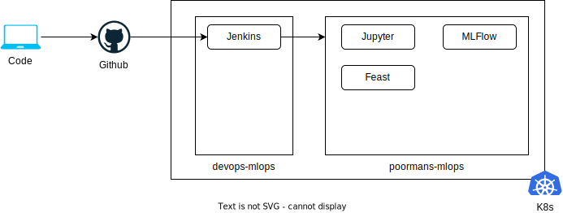

# Poorman's MLOps

Aiming to build a minimum MLOps environment on local kubernetes cluster. The environment will include components for model training (Jupyter), experimentation (MLFlow), feature store (Feast) and more...

